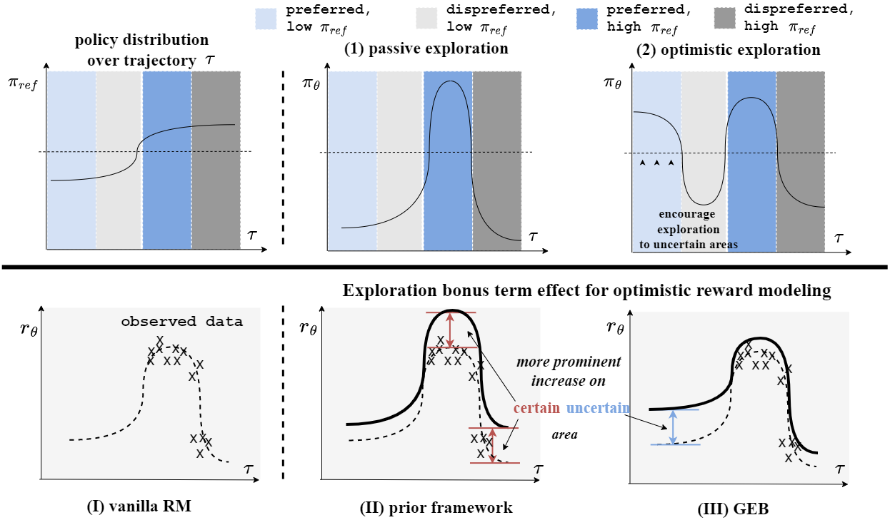

<div align="center">

# General Exploratory Bonus for Optimistic Exploration in RLHF


[](https://arxiv.org/pdf/2510.03269) [](https://github.com/WindyLee0822/GEB) [](https://huggingface.co/collections/Windy0822/geb)

</div>

## Introduction
<div align="center">

</div>

Optimistic exploration is central to improving sample efficiency in reinforcement learning with human feedback, yet existing exploratory bonus methods to incentivize exploration often fail to realize optimism. We provide a theoretical analysis showing that current formulations, under KL or $\alpha$-divergence regularization, unintentionally bias exploration toward high-probability regions of the reference model, thereby reinforcing conservative behavior instead of promoting discovery of uncertain regions. To address this pitfall, we introduce the **General Exploratory Bonus** (**GEB**), a novel theoretical framework that provably satisfies the optimism principle. GEB counteracts divergence-induced bias via reference-dependent reward regulation and unifies prior heuristic bonuses as special cases, while extending naturally across the full $\alpha$-divergence family. Empirically, GEB consistently outperforms baselines on alignment tasks across multiple divergence settings and large language model backbones. These results demonstrate that GEB offers both a principled and practical solution for optimistic exploration in RLHF.

## How to self-design and implement a General Exploratory Bonus (GEB)

You can self-design and implement a general exploratory bonus for online iterative f-DPO as follows:

1. Design a general exploratory bonus (GEB) with a specific alpha-divergence by $$uf'(u) - f(u)$$ where $$f$$ corresponds to divergence class. While you can flexibly choose $$u$$, where $$u>\alpha$$ is a function of $$\pi$$ that decreases monotonically with respect to $$\pi$$.

   - for example, when I choose the forward KL-divergence, the corresponding $$f$$ is $$f(u)= - \log u$$. Then, I pick $u$ as $u=\frac{1}{x}$ which decreases monotonically with respect to $$\pi$$. The final GEB formulation is $$-1 - \log \pi $$

2. Then substitute the $$\pi$$ of the GEB formulation by `rejected_policy_logprobs.exp()`, and add this term to the f-DPO loss.

   - for example, when I have the GEB formulation as $$-1 - \log \pi $$, the final loss is ```L_{f-DPO} + kappa * policy_rejected_logps``` where `kappa` is the hyperparameter, and I omit the constant 1 of the GEB formulation.
   


## Reproduction

### Train
To run the iterative online RLHF algorithm, please run

```
bash Llama_SFT_GEB.sh
```

There are some arguments you might adjust in the script:
```
loss_type: choose from [dpo,geb_p,geb_f,geb_tanh]
f_div: choose from [kl,hel,fkl]
kappa: the hyperparameter, adjust it according to section 5 of our paper
```


### Evaluation

#### 1. Generate response from models

```
python generation/generate_eval_test.py --model_name_or_path MODEL_NAME --output_name_or_path FILE_NAME
```

#### 2. Check the win rate and average reward

accelerate launch --main_process_port 29710 evaluation/check_win_rate.py --data_name test --model_name FILE_NAME

## Citation

We now have a paper you can cite:

```bibtex
@article{li2025general,
  title={General Exploratory Bonus for Optimistic Exploration in RLHF},
  author={Li, Wendi and Oh, Changdae and Li, Yixuan},
  journal={arXiv preprint arXiv:2510.03269},
  year={2025}
}
```

